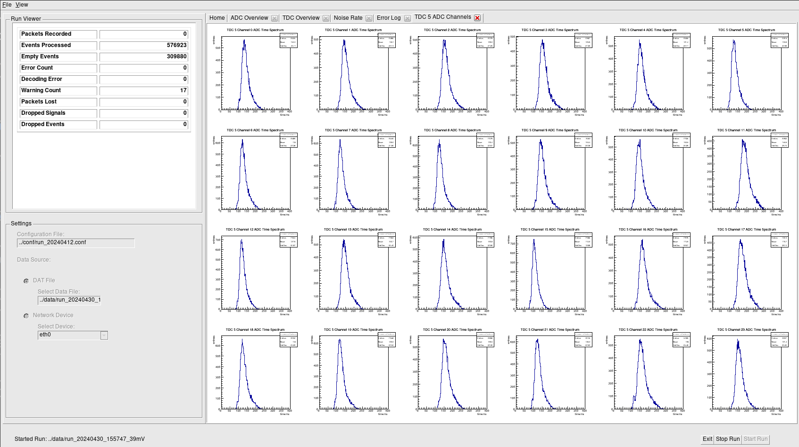
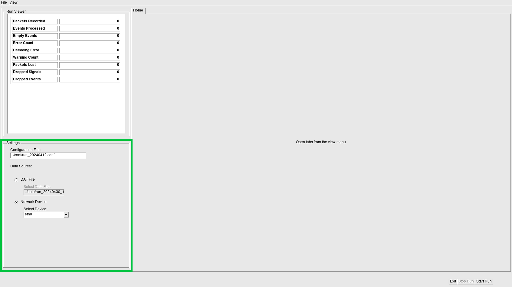
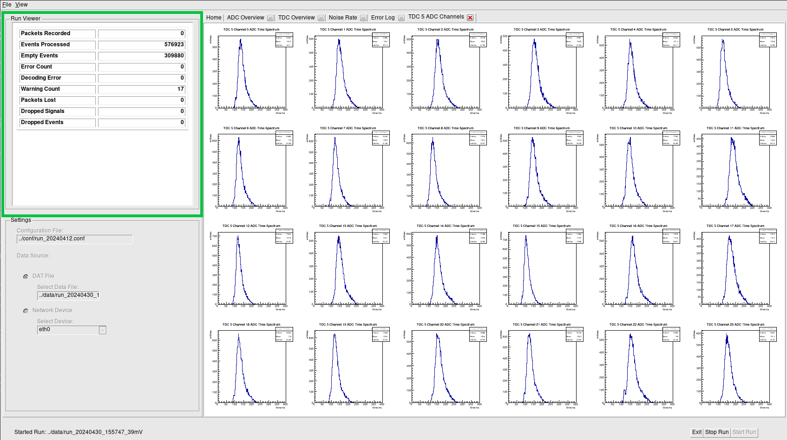

# ATLAS MiniDAQ Online Monitor

This application provides a GUI interface for monitoring miniDAQ sMDT and MDT chamber systems via an ethernet connection.



## Features

Planned features include:
* Live capture and recording of miniDAQ data packets...**DONE**
* Decoding of miniDAQ data packets from a live ethernet connection or from a data file...**DONE**
* Live data displays including hit rates, TDC, and ADC spectra...**DONE**
* Tracking and logging for malformed or erroneous data...**DONE**
* Visualization and track reconstruction for muon events...**IN PROGRESS**
* Efficiency and residuals displays...**IN PROGRESS**

## Setup

This application was developed for Linux using ROOT version 6.18/02 and gcc/g++ version 6.2.0, and requires support for C++11 or later. Windows and MacOS environments are not supported.

To install and run this application:

* [Install ROOT](https://root.cern/install/)
* [Install libpcap](https://www.tcpdump.org/index.html#latest-releases)
* Open a terminal and clone this repository with:
```
      $ git clone git@github.com:romyers/ATLAS_Online_Monitor.git
```
* Navigate to the ROOT install directory, then run:
```
      $ source bin/thisroot.sh
```
* Navigate to the ROOT_plot folder in this repository, then compile the application with:
```
      $ source setup.sh
```
* Enter a sudo password if/when prompted.
* Navigate to the build directory, then run the application with:
```
      $ ./DAQManager
```

## Usage

Prior to using this application, navigate to the ROOT install directory and run:
```
      $ source bin/thisroot.sh
```
This must be done in any terminal session used to run the application.

You can then run the online monitor from the build directory with:
```
      $ ./DAQManager
```
This will open the GUI interface, from which you can manage the online monitor's data capture, decoding, and display features. 

### Starting a Data Run

The first time you run the application, you will need to configure the settings panel to specify the data source and configuration parameters before starting a run.



File paths may be specified absolutely or as relative paths from the build directory. You must specify a configuration file before beginning a run. An example configuration file is provided in the conf directory.

To configure the application for decoding and displaying data files:
- Specify the path to a configuration file
- Select the 'DAT File' option
- Specify the path to a raw data file

To configure the application for decoding and displaying live data:
- Ensure that the miniDAQ system is configured for data capture and connected to the computer via ethernet
- Specify the path to a configuration file
- Select the 'Network Device' option
- Specify the network device corresponding to the miniDAQ system from the dropdown menu

Entries in the settings panel are saved between runs, so you will only need to reconfigure this when the data source or system configuration changes.

Once the settings panel is configured, you can start a run by clicking the 'Start Run' button at the bottom right of the interface. 


As long as data is being received, the application will periodically update the display with new information. You can stop a run at any time by clicking the 'Stop Run' button.


You can exit the application at any time by clicking the 'Exit' button or by closing the application window. This will stop any active run and close the application.


NOTE: Due to software limitations, there is a delay between when the 'Stop Run' button is clicked and when the run actually stops and the 'Start Run' button is reenabled. During this time, the application will wait for one more batch of data packets. The final batch will be recorded, but will not be decoded or displayed. This delay also occurs when exiting the program during an active run. 

You can immediately force-quit the application by pressing CTRL+C twice in the terminal.

### Monitoring a Run

Data decoded during a run will be displayed in aggregate in the Run Viewer panel:



Here, you can find:
- **Packets Recorded**: The number of data packets, if any, received from the miniDAQ system via ethernet.
- **Events Processed**: The number of events decoded from the raw data.
- **Empty Events**: The number of decoded events containing no hits.
- **Error Count**: The number of errors encountered during the run.
- **Decode Error**: The number of errors encountered during the decoding process.
- **Warning Count**: The number of warnings encountered during the run.
- **Packets Lost**: The number of data packets lost during the run.
- **Dropped Signals**: The number of signals found to be erroneous and discarded during the run.
- **Dropped Events**: The number of events found to be erroneous and discarded during the run.

The Run Viewer panel will be updated every time a new batch of data is decoded.

Graphical data displays can be accessed from the 'View' menubar option at the top left of the interface.


The 'View' menu provides the following options:
- **ADC Plots**: Provides a submenu with an *ADC Overview* plot showing aggregate ADC time spectra for each TDC together with ADC channel plots for each TDC showing ADC time spectra for each channel on that TDC.
- **TDC Plots**: Provides a submenu with a *TDC Overview* plot showing aggregate TDC time spectra for each TDC together with TDC channel plots for each TDC showing TDC time spectra for each channel on that TDC.
- **Noise Rate**: Displays hit rate histograms for each TDC.
- **Error Log**: Displays a log of errors and warnings encountered during the run.

Each display will appear as a tab in the main viewport. 

### Recording Data

The application will automatically save data captured from an ethernet source to a timestamped .dat file in the data directory, creating this directory if it does not exist. Data is saved continuously during a run, and recorded data will not be lost if the program is stopped or crashes.

Decoded hit rates will be automatically saved to the output directory as a timestamped CSV file.

Graphical data displays can be saved by selecting the 'Save Plots' option from the 'File' menu.
  - This feature is experimental. Do not interact with the application while saving plots.

## Common Problems

### The application fails to build.
- Make sure all dependencies are installed. 
  - If you're seeing errors linking to .so libraries, you probably just need to install those libraries. For example, when tested on a WSL2 Ubuntu distribution, it was necessary to install libncurse5, even though it was not listed as a dependency in the ROOT installation guide.
- Ensure that the ROOT environment is properly prepared before building the application. Navigate to the ROOT install directory and run:
  ```
     $ source bin/thisroot.sh
  ```
- If errors related to libpcap are encountered, try manually specifying PCAP_ROOT_DIR in FindPCAP.cmake.
### The application has been built successfully, but fails to launch.
- Ensure that the ROOT environment is properly prepared before running the application. Navigate to the ROOT install directory and run:
```
    $ source bin/thisroot.sh
```
### No network devices appear in the dropdown.
- The application may not have the necessary permissions to access network devices. Try:
```
    $ ./setEcapPermissions.sh
```
### The application crashes with an error like, "You don't have permission to capture on that device."
- The application may not have the necessary permissions to access network devices. Try:
```
    $ ./setEcapPermissions.sh
```
### The 'Start Run', 'Stop Run', or 'Exit' buttons do not appear.
- This is a known issue. In its current state, the application may not display correctly on all screen resolutions and may not be dynamically resized. Try increasing the screen resolution. 